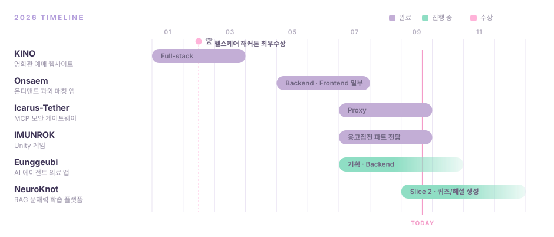

<!-- ═══════════════════════════════ HEADER ═══════════════════════════════ -->

 

 

<!-- ═══════════════════════════════ STACK ═══════════════════════════════ -->

## 🛠️ Tech Stack

**Language & Framework**

**Database**

**Infra & DevOps**

 

<b>🧩 Experienced</b>

 

<b>⚙️ Tools</b>

 

 

<!-- ═══════════════════════════════ TIMELINE ═══════════════════════════════ -->

## 🗓️ Timeline

 

<!-- ═══════════════════════════════ PROJECTS ═══════════════════════════════ -->

## 📦 Projects

| 기간 | 프로젝트 | 역할 |
|:---|:---|:---|
| `2026.01 – 03` | **KINO** — 영화관 예매 웹사이트 | Full-stack |
| `2026.05 – 07` | **Onsaem** — 온디맨드 과외 매칭 앱 | Backend · Frontend 일부 |
| `2026.07 – 09` | **Icarus-Tether** — MCP 보안 게이트웨이 | Proxy 파트 |
| `2026.07 – 09` | **IMUNROK** — Unity 게임 | 옹고집전 파트 전담 |
| `2026.07 – 10` | **Eunggeubi** — AI 에이전트 의료 앱 | 기획 · Backend |
| `2026.09 –` | **NeuroKnot** — RAG 문해력 학습 플랫폼 | Slice 2 · 퀴즈/해설 생성 |

 

> **NeuroKnot · Slice 2** — Claude 구조화 출력으로 근거 위치와 오답 유형을 포함한 해설 생성,
> Batch API 기반 퀴즈 배치 생성, 프롬프트 캐싱, eval 셋 구축까지 RAG의 **G** 파트를 담당합니다.

 

## 🏆 Award

> **IT × Healthcare Hackathon 최우수상** · `2026.02`

 

